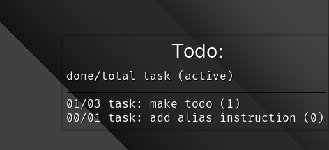

# TODO-CONKY

## What?

a simple conky todo list :scroll:

## Why?

1. to remember what to do :smiley:
1. to have it on desktop in front of :eyes:

## Dependency

1. conky (uses lua)

## How to install?

1. move todo folder to location of you choice
1. run `conky -qc $path_to_todo_conf`

## How to uninstall?

1. delete todo folder

## How to use?

1. use text editor to edit `todo.md`. make an alias for faster access.
2. create a task with `##`
3. add step to using `[ ]`
4. make step active using `[.]`
5. mark done step using `[x]`

> [!NOTE]
> * these symbols should be at start of line
> * order of task is maintained. So add important once first
